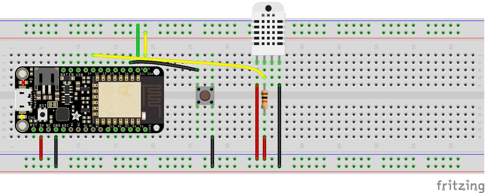
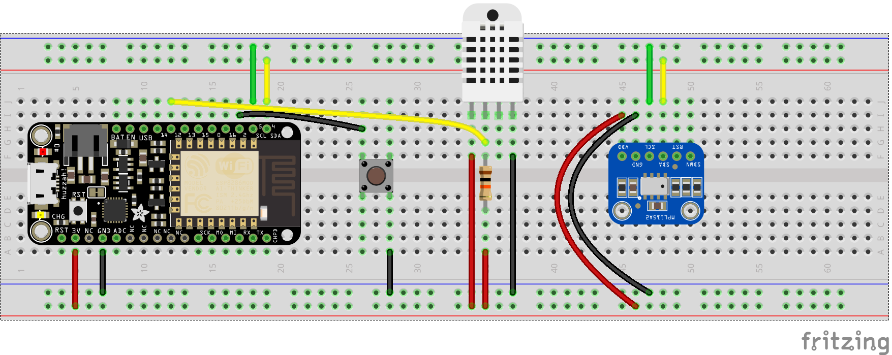

# HCDE 400 ICE #3: Intergrating Sensors and Displays
Here is the link to my Adafruit.io [dashboard](https://io.adafruit.com/LuffyWesley/dashboards/analog) that houses feeds for temperature, humidity and pressure.

## Libraries required
1. DHT sensor library by Adafruit
2. MPL115A2 by Adafruit
3. Adafruit GFX library by Adafruit
4. Adafruit SSD1306 by Adafruit

## Tutorial Followed
1. [DHT22 sensor](https://learn.adafruit.com/dht/overview)
2. [MPL115A2](https://www.adafruit.com/product/992?gclid=CjwKCAjwqLblBRBYEiwAV3pCJko03onTE53auLlEQTZuxhZDvP1G64cttjxB3FxMnRrifscPLeQH2BoCc4sQAvD_BwE)
3. [OLED Display](https://learn.adafruit.com/monochrome-oled-breakouts/overview)

## Schematic
### DHT22

### MPL115A2

### OLED Display
